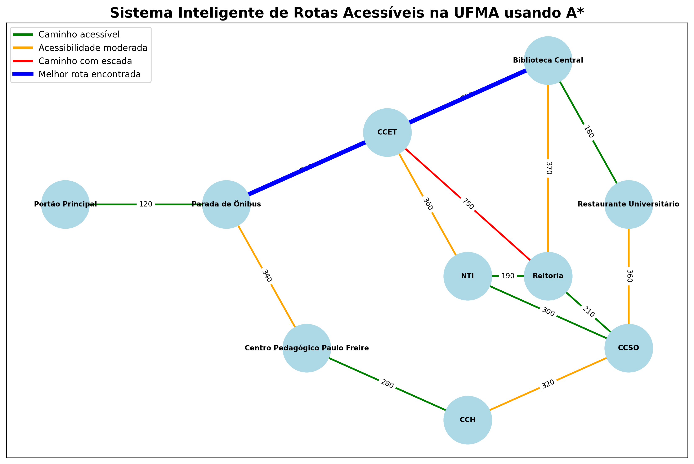

# Sistema Inteligente de Rotas Acessíveis na UFMA usando A*

## Descrição do Projeto

Este projeto implementa um sistema inteligente de busca de rotas acessíveis dentro da Universidade Federal do Maranhão (UFMA), utilizando o algoritmo A* (A Star) e modelagem em grafos com a biblioteca NetworkX.

O objetivo do sistema é encontrar a melhor rota entre dois pontos do campus considerando não apenas a menor distância, mas também fatores de acessibilidade, como presença de escadas, pisos irregulares, baixa iluminação e caminhos estreitos.

O projeto simula um sistema de navegação acessível para estudantes, servidores e visitantes com mobilidade reduzida.
## Exemplo Visual do Sistema


---
## Tecnologias Utilizadas

- Python
- NetworkX
- Matplotlib
- Algoritmo A*

---

## Como Executar

```bash
pip install -r requirements.txt
python main.py
```
# Objetivos

- Modelar um problema de busca como grafo;
- Implementar o algoritmo A*;
- Utilizar heurística baseada em distância;
- Simular rotas acessíveis dentro da UFMA;
- Analisar o impacto da acessibilidade no custo das rotas;
- Demonstrar visualmente o funcionamento da busca.

---

# Tecnologias Utilizadas

- Python
- NetworkX
- Matplotlib

---

# Modelagem do Problema

O campus da UFMA foi representado como um grafo.

## Nós

Os nós representam locais importantes da universidade:

- Portão Principal
- Parada de Ônibus
- CCET
- Biblioteca Central
- Restaurante Universitário
- Reitoria
- Centro Pedagógico Paulo Freire
- CCH
- CCSO
- NTI

## Arestas

As arestas representam os caminhos entre os locais.

Cada aresta possui:

- distância;
- condição de acessibilidade;
- penalidade;
- peso final.
---

# Função de Custo

O custo das rotas é calculado da seguinte forma:

```text
peso final = distância + penalidade
```

## Exemplos de Penalidades

| Condição | Penalidade |
|---|---|
| Acessível | 0 |
| Piso irregular | 80 |
| Caminho estreito | 180 |
| Escada | 500 |

## Algoritmo A*

O algoritmo A* foi utilizado para encontrar a rota de menor custo entre dois pontos do grafo.

A função principal utilizada pelo algoritmo é:

```text
f(n) = g(n) + h(n)
```

Onde:

- g(n): custo acumulado até o nó atual;
- h(n): heurística baseada na distância em linha reta até o destino;
- f(n): custo total estimado.

## Heurística

A heurística utilizada calcula a distância euclidiana entre os pontos do grafo.

Ela ajuda o algoritmo a encontrar caminhos mais eficientes.

## Funcionalidades do Sistema

- Seleção interativa de origem e destino;
- Busca automática utilizando A*;
- Análise de acessibilidade da rota;
- Exibição do custo total;
- Exibição detalhada dos trechos;
- Visualização gráfica do grafo;
- Exportação automática da imagem da rota.

## Visualização Gráfica

O sistema gera automaticamente uma imagem contendo:

- nós do grafo;
- pesos das conexões;
- níveis de acessibilidade;
- melhor rota encontrada.

### Legenda

- Verde: caminho acessível;
- Laranja: acessibilidade moderada;
- Vermelho: caminho com escada;
- Azul: melhor rota encontrada.

---

# Exemplo Visual do Sistema

